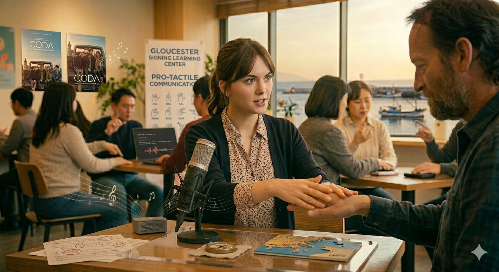

# Coda

In the film *CODA*, music paradoxically functions as a medium to depict hearing impairment and Deaf culture through the aesthetics of silence. From a medical humanities perspective, this narrative deeply challenges the historical institutionalization of the "normal body" and "proper listening". As seen in the 19th-century discipline at the Paris Orthopedic Institute where figures like Chopin taught, conventional music education has long enforced an auditory-centric standard that regulates the human physique and marginalizes variant bodily experiences. The film highlights this rigid boundary through Ruby's training under her instructor, whose traditional expectations echo the biomedical framework that labels her family's silent world as a mere "Disease" (ICD: H90.3) to be cured or corrected. This clinical reductionism inherently ignores what Eric Cassell and Rita Charon define as "Illness"—the lived, subjective experience of the human being within their socio-cultural environment. *CODA* subverts this alienation by restoring Arthur Frank's "illness narrative" and channeling William Cheng's *Just Vibrations*, transforming music from an exclusive auditory act into an inclusive site of empathy and mutual recognitionㄹ. 

The pinnacle of this subversion is revealed in the scene of Ruby's school choir performance. Amidst a series of beautiful harmonies, the film's sound suddenly switches to complete silence; this bold on-screen silence allows the audience to break away from the auditory-centric perspective of non-disabled people and fully experience the family's lifeworld firsthand. Instead of listening to their daughter's singing, the deaf parents share an emotional bond that transcends the barriers of language. This visual and somatic communion bypasses the limitations noted by Elaine Scarry, who argued that intense bodily differences or pain destroy conventional language and necessitate entirely new forms of translation. Much like C.P.E. Bach physically translated his somatic gout suffering into localized, erratic musical gestures in his *Fantasia*, *CODA* introduces a profound musical somatization. In the Berklee College of Music audition scene, Ruby therapeutically integrates two separated worlds by singing aloud while simultaneously using sign language with her hands. Furthermore, when she returns home, her father places his hand on her neck to "listen" to his daughter's singing with his whole body through the subtle vibrations of her vocal cords. This tactile connection demonstrates that music transcends the narrow biomedical definition of an auditory act heard through the ears, proving that while hearing impairment may be viewed as a physical defect from a medical standpoint, from the perspective of human dignity, it can become the most powerful narrative language for connecting different worlds and expanding communication. If you would like to refer to other archives regarding the same work, please refer [here](kang-jeonwoong.md).

# 코다

영화 <코다(CODA)>에서 음악은 역설적으로 침묵의 미학을 통해 청각 장애와 농문화를 묘사하는 매개체로 기능합니다. 역사적으로 19세기 파리 정형외과 연구소에서 쇼팽의 학생들이 신체를 교정 기구로 구속당한 채 '정형화된 연주 자세'를 강요받았듯, 근대 음악 제도는 비장애인의 신체와 기성의 청각 지각만을 '정상 규범'으로 정의하고 통제해 왔습니다. 영화는 주인공 루비가 비장애인 중심의 청각 예술 공간에 진입하는 과정을 보여주며, 소리 중심 사회가 지닌 신체 규율성과 그 장벽 속에서 농인 가족들이 마주하는 소외를 극적으로 대비시킵니다.
이러한 연출의 정점은 루비의 학교 합창단 공연 장면에서 드러납니다. [영화 <코다> 공식 합창단 공연 장면 보기](https://www.youtube.com/watch?v=-1GJLMRKcyo) 아름다운 화음이 이어지던 중 영화의 사운드가 갑자기 완벽한 무음으로 전환되는데, 이 과감한 스크린 속 침묵은 근대 의학이 규정해 온 생물학적 수치 중심의 '질병(Disease, ICD: H90.3)' 관점을 일시적으로 해체합니다. 관객들은 청인 중심의 청각적 시선에서 벗어나, 환자이자 주체로서 세상을 살아가는 이들의 주관적 경험인 '질환(Illness)'의 세계를 온전히 직접 경험하게 됩니다. 농인 부모는 딸의 노래를 귀로 듣는 대신, 주변 청중들의 감동 어린 표정, 들썩이는 어깨, 공연장의 공기 진동과 같은 신체적·시각적 단서를 통해 아서 프랭크가 말한 '몸의 증언'과도 같은 깊은 서사적 유대감을 공유합니다.
나아가 버클리 음대 오디션 장면에서 루비는 소리 내어 노래를 부르는 동시에 손으로 수어를 함께 구사함으로써 분리되어 있던 두 세계를 치유적으로 통합하며 리타 샤론의 서사의학적 경청을 무대 위에서 실천합니다. 오디션을 마친 후 집으로 돌아와 아버지가 루비의 목에 손을 대고 성대의 미세한 떨림을 통해 딸의 노래를 온몸으로 '듣는' 촉각적 교감의 장면은 의료인문학적으로 매우 중요한 통찰을 제공합니다. 엘레인 스캐리가 지적했듯 감각의 단절과 신체적 한계는 기존의 언어를 파괴하지만, C.P.E. 바흐가 자신의 통풍 통증을 《환상곡》의 찌르고 배회하는 격렬한 패시지로 번역해 냈듯이 루비의 가족은 소리를 물리적 진동으로 변환하는 '음악적 신체화(Somatization)'를 통해 새로운 차원의 소통을 창조합니다.
이 영화에서 음악은 단순히 '귀로 듣는 청각적 행위'라는 생물학적 정의를 넘어, 진동과 수어, 신체적 현존과 촉각을 통해 감정이 전달될 수 있음을 보여줍니다. 즉, 윌리엄 청의 지적처럼 기계적 진단에만 몰두하는 의학 관점에서의 청각 장애는 '치료해야 할 신체적 결손'일지라도, 인간 존엄성의 관점에서는 서로 다른 세계를 연결하고 소통을 확장하는 가장 강력한 내러티브 언어가 될 수 있음을 증명합니다. 같은 작품에 대한 다른 아카이브를 참조하고 싶으시면 [여기](kang-jeonwoong.md)를 참조해주세요.

# A Song I Want to Be Played at My Funeral-'Funeral Hope'

The song I would like to be played at my funeral is [Lee Chan-hyuk’s 'Funeral Hope'](https://youtu.be/iIn_1_XDuBM?si=1MDq4Oq13Z0Yj3c-). The reason I want this song to be played is that it expresses the sentiments and regrets felt while observing a personal funeral after death in a joyful way, rather than in a purely negative light. I believe this will allow it to remain a good memory for those who are with me at my final moments. In particular, the lyrics quietly whisper about not being able to convey my thoughts and feelings; I felt that this fully conveys the thoughts felt while describing my funeral from a third-party perspective, rather than merely wishing for a vaguely pleasant ending.

# 내 장례식에서 연주 됐으면 하는 곡-'장례 희망'

제 장례식에서 연주 됐으면 하는 곡은 [이찬혁의 '장례희망'](https://youtu.be/iIn_1_XDuBM?si=1MDq4Oq13Z0Yj3c-)입니다. 이 곡이 연주 됐으면 하는 이유는 사후 개인의 장례식을 바라보면서 느끼는 감회, 후회를 마냥 부정적이지 않고 즐겁게 푼다는 점이 내 마지막을 함께 해주는 사람들에게도 좋은 기억으로 남을 수 있게 해줄 수 있을 것 같아서 입니다. 특히 가사에서 나지막히 내 생각, 마음을 전하지 못 했다는 말을 읊조리는데, 이는 막연히 기분 좋은 마지막을 바라는 것이 아닌 제 3자의 입장에서 내 장례식을 서술하면서 느끼는 생각을 온전히 전하고 있다고 생각이 들었습니다. 

